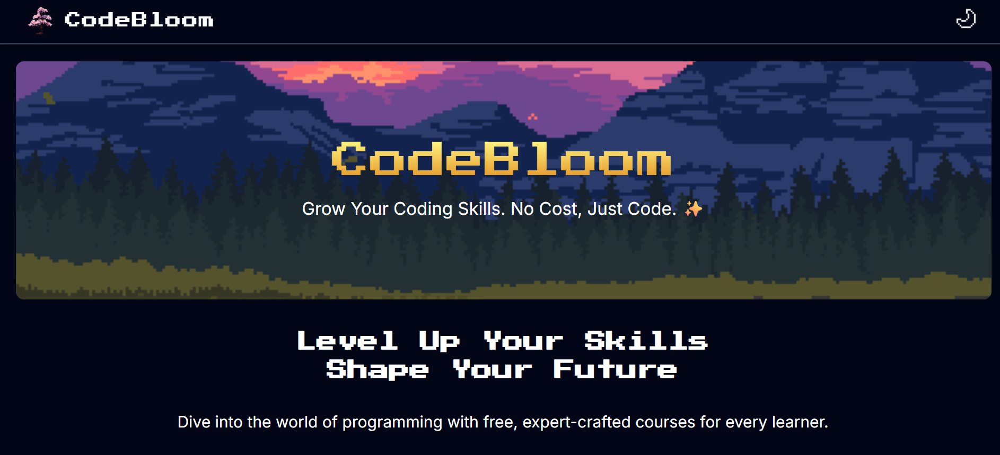
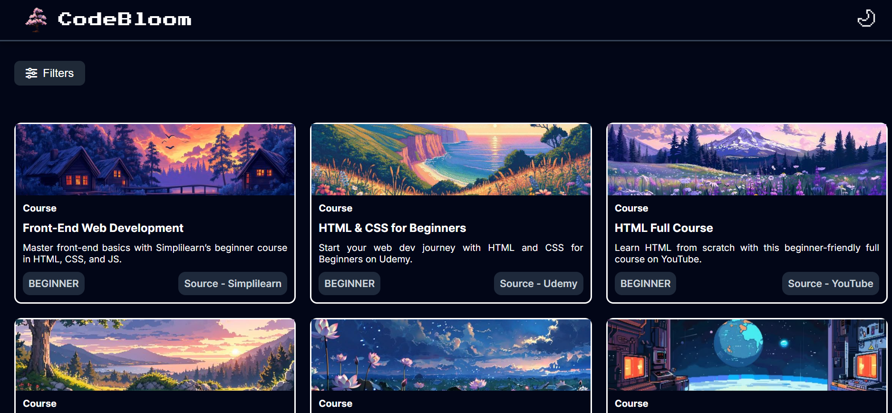

## Course Catalog (CodeBloom)

CodeBloom is a free, interactive course catalog web app designed to help users discover and filter high-quality programming courses. It features a modern UI, dark/light theme toggle, and advanced filtering options for topics, duration, and difficulty.

---

## Preview

---

### Features
- **Course Catalog:** Browse curated programming courses in Web Development, Data Science, and Tools.
- **Filtering:** Filter courses by topic, duration (Short/Medium/Long), and difficulty (Beginner/Intermediate/Advanced).
- **Theme Toggle:** Switch between dark and light modes for comfortable viewing.
- **Responsive Design:** Works seamlessly on desktop and mobile devices.
- **Source Links:** Direct links to course providers (YouTube, Udemy, freeCodeCamp, GeeksForGeeks, etc.).

---

### How It Works
1. **Browse Courses:** Scroll through the catalog to view available courses, each with a description, difficulty, and source.
2. **Apply Filters:** Click the Filters button to select your preferred topic, duration, and difficulty. Click Apply to update the catalog.
3. **Theme Toggle:** Use the moon/sun icon in the navbar to switch between dark and light modes.
4. **Course Details:** Click on a course card to visit the provider and start learning.

---

### Project Structure
- `index.html` — Main HTML file for the catalog UI
- `style.css` — Custom styles for layout, cards, navbar, and responsive design
- `app.js` — Handles theme toggling and UI interactions
- `filter.js` — Manages filter popup logic and course filtering
- `assets/` — Images and icons for UI elements and course cards

---

### Technologies Used
- HTML5, CSS3, JavaScript (Vanilla)
- Font Awesome for icons
- Responsive design techniques

---

### Credits
- Course data sourced from YouTube, Udemy, freeCodeCamp, GeeksForGeeks, W3Schools, and more
- UI inspired by modern web design trends
- Built with ❤️ by Akshansh

---

### License
This project is open-source and free to use for educational purposes.
